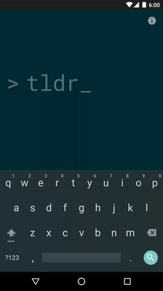

## tldroid
[tldr](https://github.com/tldr-pages/tldr) Android client

### Setup
**Requirements**
- Latest Android SDK tools
- Latest Android platform tools
- Android SDK Build tools 23.0.2
- Android SDK 23
- Android Support Repository
- Android Support Library 23.1.1

**Dependencies**

- [AOSP design support library](https://developer.android.com/tools/support-library/features.html#design)
- [Square OkHttp](https://github.com/square/okhttp)
- [google-gson](https://github.com/google/gson) - JSON to Java object converter
- [Txtmark](https://github.com/rjeschke/txtmark) - Java markdown processor
- [tldr-pages](https://github.com/tldr-pages/tldr) - community-driven man pages

**Build**

    ./gradlew :app:assembleDebug

### License
    Copyright 2015 Ha Duy Trung

    Licensed under the Apache License, Version 2.0 (the "License");
    you may not use this file except in compliance with the License.
    You may obtain a copy of the License at

        http://www.apache.org/licenses/LICENSE-2.0

    Unless required by applicable law or agreed to in writing, software
    distributed under the License is distributed on an "AS IS" BASIS,
    WITHOUT WARRANTIES OR CONDITIONS OF ANY KIND, either express or implied.
    See the License for the specific language governing permissions and
    limitations under the License.
